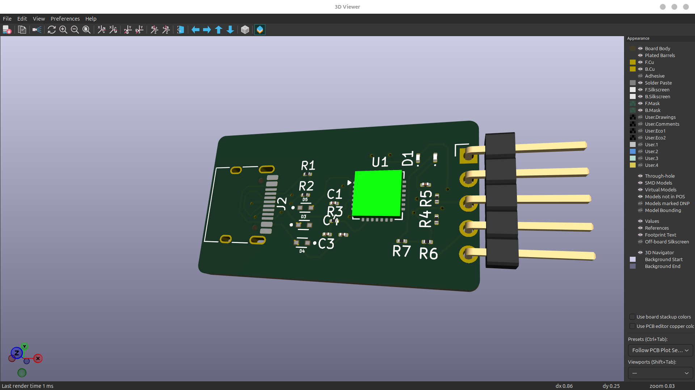
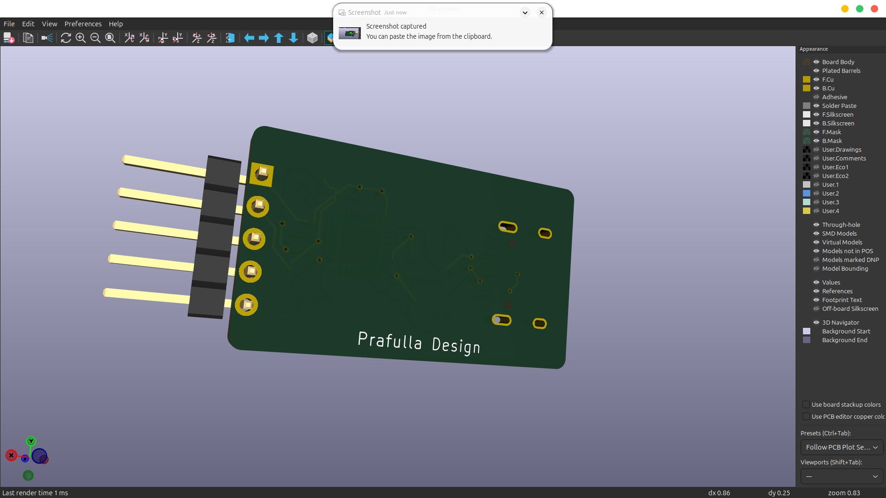
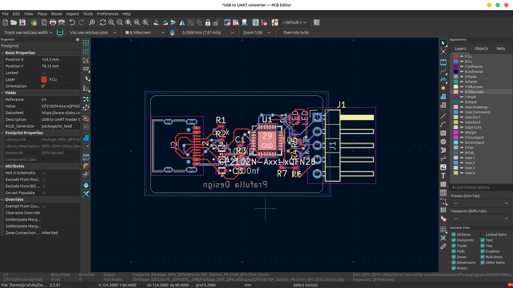
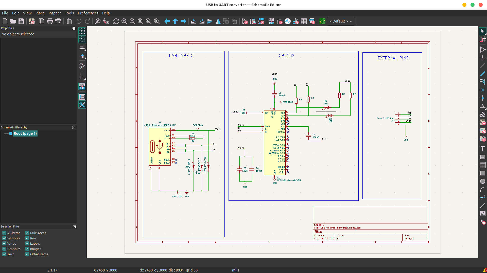

# USB to UART Converter

This repository contains a simple USB to UART converter PCB designed in KiCad. It is a practice project focused on learning schematic capture, PCB layout, routing, and 3D visualization.

The design uses a USB Type-C input and a CP2102N USB-to-UART bridge to expose serial signals on an external pin header. The board also includes supporting passive components, indicator LEDs, and the required USB power and signal connections.

## Project Overview

- USB Type-C connector for power and USB data
- CP2102N USB-to-UART bridge
- External UART header for serial access
- Compact PCB layout with routed traces and silkscreen labeling

## Files In This Project

- USB to UART converter.kicad_pro - KiCad project file
- USB to UART converter.kicad_sch - schematic
- USB to UART converter.kicad_pcb - PCB layout
- frontView.png - front 3D view of the board
- backView.png - back 3D view of the board
- routing.png - PCB routing view
- schematics.png - schematic screenshot

## Board Images

### Front View

### Back View

### Routing View

### Schematic

## Notes

This is a practice project, so it is intended for learning and experimentation rather than production use.
Hence some missing footprint library is ignored.

## Working With The Design

Open the project in KiCad to inspect the schematic, board layout, and 3D model. From there you can review the routing, modify the component placement, or export fabrication files if needed.